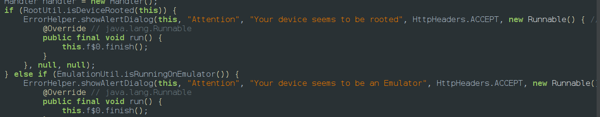
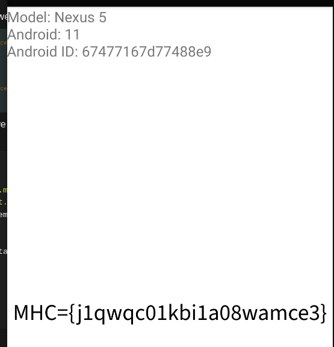

Root Quest
> Description:An application implements checks to detect rooted devices and emulators, preventing normal usage. Can you bypass these protections?

The challenge can be solved in 3 ways 
one by installing the apk in non rooted emulator in genymotion and bypass the emulator check to to get the flag
Second way is bypass the root and emulator checks available in genymotion
Third install in your own device
Intially I thought it was a normal root check and thought to use objection to bypass the root check but i got stuck at emulator check

Lets do the second method if we analyse in jadx we can find 2 checks in splash activity

each from RootUtil and EMulatorUtil classes so we can bypass them using frida so the script which i used was 
```python
Java.perform(() => {
    var Interceptor = Java.use("com.just.mobile.sec.challenge3.EmulationUtil");
    var Interceptor1 = Java.use("com.just.mobile.sec.challenge3.RootUtil");
    Interceptor.isRunningOnEmulator.implementation = function(){
        return 0;
    }
    Interceptor1.isDeviceRooted.implementation = function(){
        return 0
    }
    
})
```
After running this script we can find the flag
